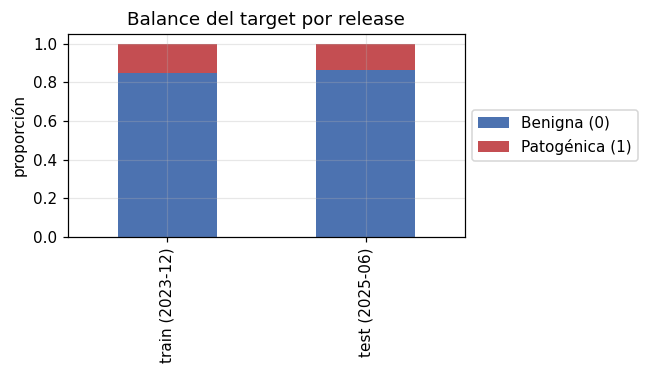
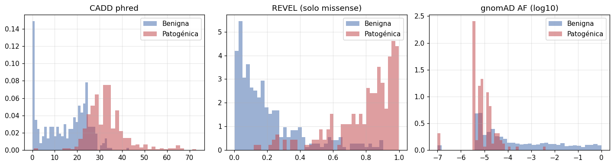
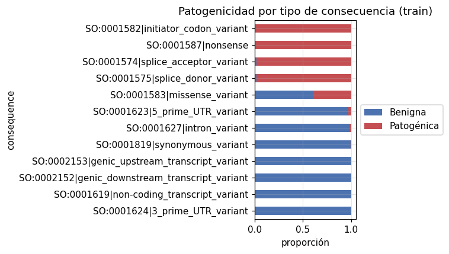
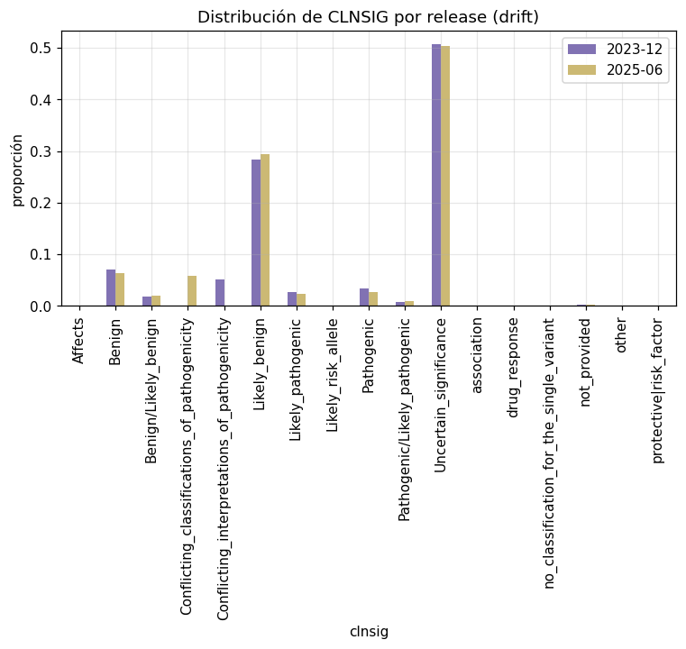

# EDA: Variantes anotadas (Fase I · bloque de trabajo)

Resumen de los hallazgos del análisis exploratorio (`notebooks/01_eda_variantes.ipynb`).
Insumo directo del capítulo de Metodología/Resultados de la memoria.

## Volumen y balance del target
| Split | Release | Etiquetadas | Positivas (patogénicas) | Prevalencia | VUS reservadas |
|-------|---------|-------------|--------------------------|-------------|-----------------|
| train | 2023-12 | 3.224 | 1.860 | 0,577 | 2.776 |
| test | 2025-06 | 4.044 | 2.310 | 0,571 | 3.156 |

El target queda binarizado según la configuración del proyecto; las VUS no se descartan sino que se
reservan como conjunto de inferencia realista.

## Separabilidad de las features
CADD, REVEL y la frecuencia gnomAD (en log) separan las clases, aunque con
**solapamiento** (error de Bayes realista): hay señal aprendible con algoritmos
estándar, pero no es un problema trivialmente perfecto.

Las consecuencias truncantes (`stop_gained`, `frameshift_variant`, `splice_*`)
concentran patogenicidad; las sinónimas concentran benignidad.

## Concept drift temporal (ClinVar 2023-12 → 2025-06)
* Variantes compartidas entre releases: **6.000**.
* **VUS reclasificadas** en la release nueva: **166** (84 → *Likely_pathogenic*, 82 → *Likely_benign*).
* **Variantes nuevas** solo presentes en 2025-06: **1.200**.

Este drift es **real, no simulado trivialmente**: reproduce el fenómeno clínico de
resolución de VUS y de incorporación de nuevas variantes entre releases de ClinVar.
Justifica la monitorización y el reentrenamiento del bloque de trabajo (OE5).

## Implicaciones para el modelado * Métricas apropiadas para posible desbalanceo: **PR AUC, F1, ROC AUC** + matriz de confusión.
* Imputación necesaria: SIFT/PolyPhen/REVEL son NaN fuera de *missense* (como en dbNSFP real).
* El split temporal train(2023-12)/test(2025-06) permite medir degradación realista.
